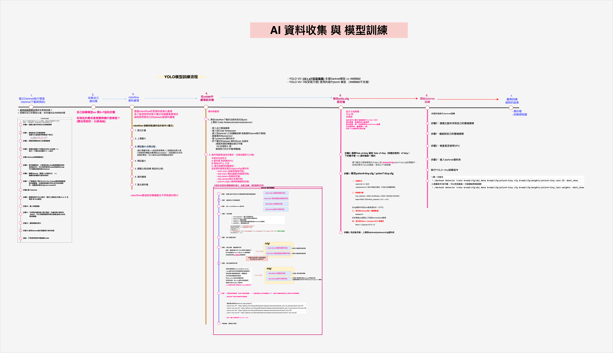

# 專案大綱

- 剛從健行科大『AIoT 物聯網暨人工智慧工程師實戰班』結訓，就想說把 AI 這塊和 IOT 物聯網串連起來，於是就以自己手邊有的寶可夢公仔為 AI 模型訓練的資料，做一個商品辨識結帳系統，以下是我的專案架構 以及 AI 模型訓練流程：

  - 專案架構圖：

    - 

  - AI 模型訓練流程
    - 

## 公仔商品辨識結帳-DEMO 影片演練(請點擊以下圖片 YT 觀看)

---

## <a href="https://www.youtube.com/watch?v=b0CbNcgBwGQ" target="_blank"></a>

也可以直接點擊於此 [公仔商品辨識結帳](https://www.youtube.com/watch?v=b0CbNcgBwGQ)

---

## 專案初始化

```bash
$ mkdir ToyVisionPay_project
 # 建立專案資料夾
$ cd ToyVisionPay_project # 進入該專案資料夾
$ git init . # 在本地數據庫-建立空儲存庫

$ mkdir web_server
$ python3 -m venv web\_server/
$ source web\_server/bin/activate
$ cd web_server
$ touch server.py
$ flask --app server run --debug #runserver 你要在web_server底下執行
#or
$ flask --app server run --port 5001

```

## 專案資料夾結構：ARDUINO IDE 程式碼 ＆ Ai 訓練模型權重檔

- 以下為我的公仔商品辨識資料夾結構：

```
/ToyVisionPay_project
│
├── /ObjectDetectionCallback # ARDUINO IDE 資料夾
│   ├── ObjectDetectionCallback.ino # 編譯AMB82 C程式碼
│   ├── ObjectClassList.h  # COCO 圖像資料集 80 個類別(我客製化為前四種類別:妙蛙種子｜小火龍｜可達鴨｜傑尼龜)
│
├── /yolov4_tiny_AI_dataset # 訓練ai模型的資料集
│   └── ToyVision_Pay_Training_done/ # 存放為google colab訓練完模型權重檔
│   └── ame82_nb/   # 存放已轉檔為 ame82的ai模型檔
│   └── dataset/    # robotflow標註類別產出的資料集
│   └── yolov4-tiny.cfg    # yolov4-tiny.cfg 原始空的模型檔
│
├── /web_server  # FLASK 後端
│   └── server.py  # 主要執行檔
│   └── templates/   # 模板
│   │   └── index.html   # 購物車結帳頁
│   └── static/    # 靜態檔案
│       └── uploads/   # 圖片檔

```
